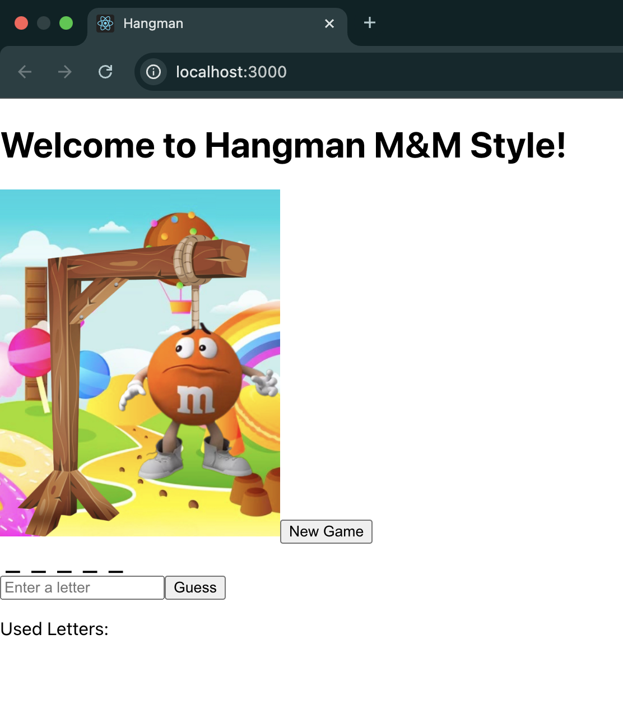

# 🎮 Hangman Game (M&M Edition) – V2.0 Enhanced with Docker + MongoDB 📊

Welcome to the **enhanced version (v2.0)** of the Hangman Game! After the success of our first release, this version brings full-stack features including backend integration and persistent stat tracking using a database.

This upgrade fulfills three critical enhancement goals:

1. ✅ **Unit tests** for stability  
2. ✅ **MongoDB integration** using Docker Compose  
3. ✅ **User win/loss tracking** with calculated winning percentages

---

## 🆕 What’s New in Version 2.0?

✔️ Tracks wins and losses per player  
✔️ Calculates and displays **winning percentage**  
✔️ Connects to a **MongoDB instance via Docker**  
✔️ Includes **Jest unit tests** to prevent regressions  
✔️ Cleanly separated **frontend (React)** and **backend (Node + Express)**  

---

## 📸 Screenshot



---

## 🚀 Getting Started

### 🐳 1. Run Full App with Docker Compose

Make sure Docker is running, then from the root project folder:

```bash
docker-compose up --build
```

This will:
- Start the **backend server**
- Launch a **MongoDB instance**
- Allow full tracking of player win/loss stats

---

### 💻 2. Launch Frontend (React App)

```bash
cd frontend
npm install
npm start
```

Play the game at: [http://localhost:3000](http://localhost:3000)

---

### 🔌 3. Start Backend API (Express + MongoDB)

```bash
cd backend
npm install
npm start
```

Backend is available at: [http://localhost:5050](http://localhost:5050)

---

### 🧪 4. Run Unit Tests (Jest)

```bash
cd backend
npm test
```

This ensures core functionality remains stable with every update.

---

## 🗂️ Project Structure Overview

```
hangman-v2/
├── frontend/                # React UI with M&M hangman character
│   └── src/
├── backend/                 # Node.js API with MongoDB tracking
│   ├── models/Player.js     # Schema for player stats
│   ├── routes/              # Express routes
│   └── tests/               # Unit tests
├── docker-compose.yml       # Mongo + backend orchestration
├── .env                     # Environment variables
```

---

## 📦 Technologies Used

- **React.js** – Frontend UI  
- **Node.js + Express** – Backend API  
- **MongoDB** – Persistent win/loss tracking  
- **Docker Compose** – Local environment setup  
- **Jest** – Unit testing framework  

---

## 🔗 References

📚 Based on MongoDB Docker setup from this guide:  
[How to run MongoDB in Docker locally (Medium)](https://medium.com/norsys-octogone/a-local-environment-for-mongodb-with-docker-compose-ba52445b93ed)

---

## 👤 Author

**Aunaje' Caldwell**  
📧 caldwellaunaje@gmail.com  
🔗 GitHub: [Aunajec](https://github.com/Aunajec)
